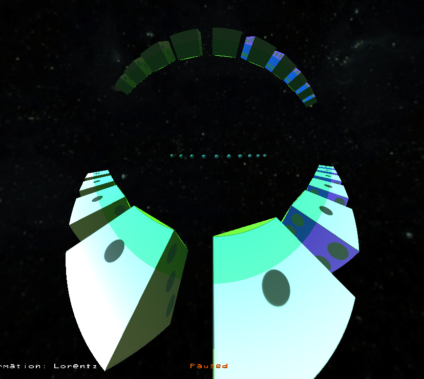
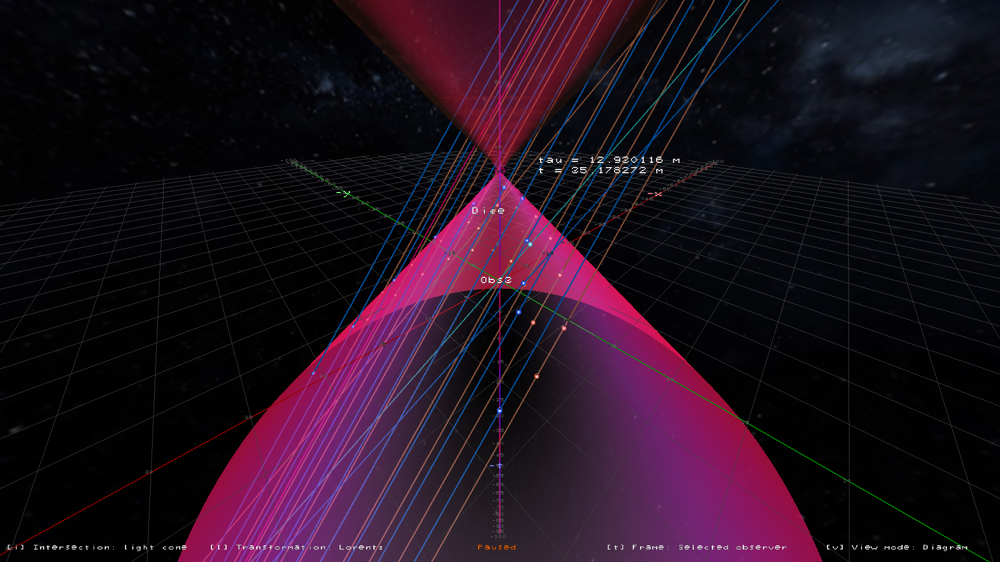

# ModellingOfRelativisticPhysics

A software application that models and visualizes relativistic physical phenomena based on Albert Einstein’s special theory of relativity.
The code was written in C++ using OpenGL.

## Screenshots

